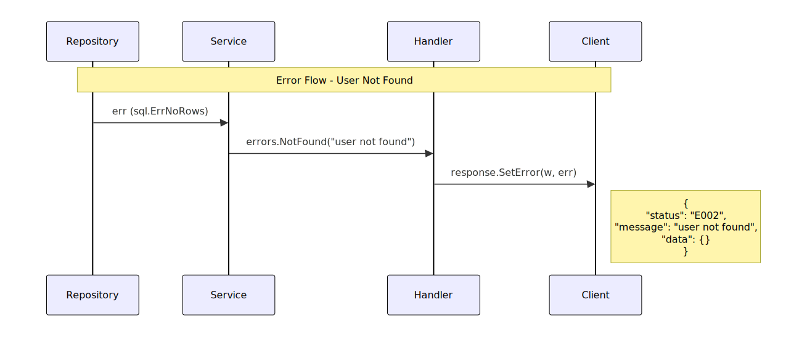

# Bab 13: Error Handler

Setelah memiliki standard response, langkah selanjutnya adalah menyempurnakan cara kita menangani error. Tidak semua error adalah "Internal Server Error". Client perlu tahu apakah error terjadi karena:
- Input tidak valid (Bad Request)
- Data tidak ditemukan (Not Found)
- Tidak punya akses (Forbidden)
- Belum login (Unauthorized)

Bab ini akan membangun sistem error handling yang konsisten dan informatif.

> **📂 Kode Lengkap Bab Ini:**  
> Seluruh kode yang dibahas di bab ini tersedia di GitHub:
>
> 🔗 [github.com/jacky-htg/workshop/tree/main/13-error-handler](https://github.com/jacky-htg/workshop/tree/main/13-error-handler)

## 13.1 Masalah dengan Error Handling Saat Ini

Saat ini, semua error dari service langsung dibungkus menjadi InternalServerError:

```go
// Sebelumnya
if err != nil {
    response.SetError(u.log, w, http.StatusInternalServerError, 
        response.AppBusinessStatusError, err, "Failed to list users")
    return
}
```

Masalah:
- Error "user not found" juga dianggap Internal Server Error (seharusnya 404)
- Client tidak bisa membedakan jenis error
- Tidak ada kode error standar untuk frontend

## 13.2 Desain Custom Error

Kita akan membuat custom error type yang mengimplementasikan interface error bawaan Go:

```go
type BusinessError struct {
	Err        error
	Code       string
	Message    string
	HTTPStatus int
}
```

Contoh error yang akan dihasilkan:

| Skenario | Code | HTTP Status | Message |
|----------|------|-------------|---------|
| Input tidak valid | E001 | 400 | "Invalid input" |
| Data tidak ditemukan | E002 | 404 | "Resource not found" |
| Akses ditolak | E003 | 403 | "Forbidden" |
| Belum login | E004 | 401 | "Unauthorized" |
| Error internal | E000 | 500 | "Internal Server Error" |

## 13.3 Implementasi Custom Error

Buat file `pkg/errors/errors.go`:

```go
package errors

import (
	"errors"
	"fmt"
	"net/http"
)

// Business error codes
const (
	InternalServerErrorCode = "E000"
	InvalidInputCode        = "E001"
	NotFoundCode            = "E002"
	ForbiddenCode           = "E003"
	UnauthorizedCode        = "E004"
)

// Default messages
const (
	InternalServerErrorMessage = "Internal Server Error"
	InvalidInputMessage        = "Invalid input"
	NotFoundMessage            = "Resource not found"
	ForbiddenMessage           = "Forbidden"
	UnauthorizedMessage        = "Unauthorized"
)

// BusinessError adalah custom error untuk business logic
type BusinessError struct {
	Err        error
	Code       string
	Message    string
	HTTPStatus int
}

// Error implements error interface
func (err *BusinessError) Error() string {
	if err.Err != nil {
		return fmt.Sprintf("[%s] %s: %v", err.Code, err.Message, err.Err)
	}
	return fmt.Sprintf("[%s] %s", err.Code, err.Message)
}

// Unwrap untuk error wrapping (Go 1.13+)
func (err *BusinessError) Unwrap() error {
	return err.Err
}

// Helper functions untuk create error
func ErrNew(code string, message string, httpStatus int) *BusinessError {
	return &BusinessError{
		Err:        fmt.Errorf("%s", message),
		Code:       code,
		Message:    message,
		HTTPStatus: httpStatus,
	}
}

func ErrWrap(err error, bErr *BusinessError) {
	bErr.Err = err
}


// ============= Constructor tanpa wrapping =============

func InvalidInput(message ...string) *BusinessError {
	finalMessage := InvalidInputMessage
	if len(message) > 0 && len(message[0]) > 0 {
		finalMessage = message[0]
	}
	return ErrNew(InvalidInputCode, finalMessage, http.StatusBadRequest)
}

func NotFound(message ...string) *BusinessError {
	finalMessage := NotFoundMessage
	if len(message) > 0 && len(message[0]) > 0 {
		finalMessage = message[0]
	}
	return ErrNew(NotFoundCode, finalMessage, http.StatusNotFound)
}

func Forbidden(message ...string) *BusinessError {
	finalMessage := ForbiddenMessage
	if len(message) > 0 && len(message[0]) > 0 {
		finalMessage = message[0]
	}
	return ErrNew(ForbiddenCode, finalMessage, http.StatusForbidden)
}

func Unauthorized(message ...string) *BusinessError {
	finalMessage := UnauthorizedMessage
	if len(message) > 0 && len(message[0]) > 0 {
		finalMessage = message[0]
	}
	return ErrNew(UnauthorizedCode, finalMessage, http.StatusUnauthorized)
}

func InternalServerError(message ...string) *BusinessError {
	finalMessage := InternalServerErrorMessage
	if len(message) > 0 && len(message[0]) > 0 {
		finalMessage = message[0]
	}
	return ErrNew(InternalServerErrorCode, finalMessage, http.StatusInternalServerError)
}


// ============= Constructor dengan wrapping =============

func InvalidInputWrap(err error, message ...string) *BusinessError {
	bErr := InvalidInput(message...)
	ErrWrap(err, bErr)
	return bErr
}

func NotFoundWrap(err error, message ...string) *BusinessError {
	bErr := NotFound(message...)
	ErrWrap(err, bErr)
	return bErr
}

func ForbiddenWrap(err error, message ...string) *BusinessError {
	bErr := Forbidden(message...)
	ErrWrap(err, bErr)
	return bErr
}

func UnauthorizedWrap(err error, message ...string) *BusinessError {
	bErr := Unauthorized(message...)
	ErrWrap(err, bErr)
	return bErr
}

func InternalServerErrorWrap(err error, message ...string) *BusinessError {
	bErr := InternalServerError(message...)
	ErrWrap(err, bErr)
	return bErr
}

// ============= Utility untuk ekstraksi error =============

// GetBusinessError extracts BusinessError from error chain
func GetBusinessError(err error) (*BusinessError, bool) {
	var bizErr *BusinessError
	if errors.As(err, &bizErr) {
		return bizErr, true
	}
	return nil, false
}
```

## 13.4 Update Response Helper

Sederhanakan SetError untuk menerima *BusinessError langsung:

```go
// pkg/response/response.go
package response

import (
	"context"
	"encoding/json"
	"log/slog"
	"net/http"
	"workshop/pkg/errors"

	"github.com/jacky-htg/go-libs/logger"
)

const AppBusinessStatusSuccess = "B1"

type StandardResponse struct {
	Status  string `json:"status"`
	Message string `json:"message"`
	Data    any    `json:"data"`
}

func SetResponse(log logger.Logger, w http.ResponseWriter, httpStatus int, appBusinessLogicStatus string, message string, data any) {
	standardResponse := StandardResponse{
		Status:  appBusinessLogicStatus,
		Message: message,
		Data:    data,
	}

	resp, err := json.Marshal(standardResponse)
	if err != nil {
		log.Error(context.Background(), "error: marshaling users to JSON", slog.Any("error", err))
		httpStatus = http.StatusInternalServerError
		appBusinessLogicStatus = errors.InternalServerErrorCode
		message = "Internal Server Error"
	}

	w.Header().Set("Content-Type", "application/json")
	if httpStatus != http.StatusOK {
		w.WriteHeader(httpStatus)
	}

	if _, err = w.Write(resp); err != nil {
		log.Error(context.Background(), "error: writing response", slog.Any("error", err))
	}
}

func SetError(log logger.Logger, w http.ResponseWriter, err *errors.BusinessError, message ...string) {
	finalMessage := ""
	if len(message) > 0 && len(message[0]) > 0 {
		finalMessage = message[0]
	}

	if finalMessage == "" && err != nil {
		finalMessage = err.Message
	}
	SetResponse(log, w, err.HTTPStatus, err.Code, finalMessage, struct{}{})
}

func SetOk(log logger.Logger, w http.ResponseWriter, data any) {
	SetResponse(log, w, http.StatusOK, AppBusinessStatusSuccess, "Success", data)
}

func SetCreated(log logger.Logger, w http.ResponseWriter, data any) {
	SetResponse(log, w, http.StatusCreated, AppBusinessStatusSuccess, "Created", data)
}
```

## 13.5 Update Service Layer dengan BusinessError

Setiap error di repository bisa dipertahankan karena error di repository tidak akan ditampilkan sebagai reponse dan hanya disimpan dalam log. Namun error di level service dan handler harus diubah mengikuti bisnis error yang telah ditentukan.

Service layer sekarang mengembalikan *errors.BusinessError:

```go
// internal/service/users.go
package service

import (
	"context"
	"log/slog"
	"workshop/internal/model"
	"workshop/internal/repository"
	"workshop/pkg/errors"

	"github.com/jacky-htg/go-libs/logger"
	"github.com/jacky-htg/go-libs/uuid7"
	"golang.org/x/crypto/bcrypt"
)

type Users interface {
	List() ([]model.User, *errors.BusinessError)
	Create(*model.User) *errors.BusinessError
	FindById(id string) (*model.User, *errors.BusinessError)
	Update(*model.User) *errors.BusinessError
	Delete(id string) *errors.BusinessError
}

type users struct {
	log  logger.Logger
	repo repository.UserRepository
}

func NewUsers(repo repository.UserRepository, log logger.Logger) Users {
	return &users{repo: repo, log: log}
}

func (u *users) List() ([]model.User, *errors.BusinessError) {
	users, err := u.repo.List()
	if err != nil {
		return nil, errors.InternalServerErrorWrap(err, "error listing users")
	}
	return users, nil
}

func (u *users) Create(user *model.User) *errors.BusinessError {

	pass, err := bcrypt.GenerateFromPassword([]byte(user.Password), bcrypt.DefaultCost)
	if err != nil {
		u.log.Error(context.Background(), "error generate password", slog.Any("error", err))
		return errors.InternalServerErrorWrap(err, "error generating password")
	}

	user.ID = uuid7.New()
	user.Password = string(pass)

	if err := u.repo.Create(user); err != nil {
		return errors.InternalServerErrorWrap(err, "error creating user")
	}

	return nil
}

func (u *users) FindById(id string) (*model.User, *errors.BusinessError) {
	user, err := u.repo.FindById(id)
	if err != nil {
		return nil, errors.InternalServerErrorWrap(err, "error finding user")
	}
	if user == nil {
		return nil, errors.NotFound("user not found")
	}
	return user, nil
}

func (u *users) Update(user *model.User) *errors.BusinessError {
	existUser, err := u.repo.FindById(user.ID)
	if err != nil {
		return errors.InternalServerErrorWrap(err, "error finding user")
	}
	if existUser == nil {
		return errors.NotFound("user not found")
	}
	err = u.repo.Update(user)
	if err != nil {
		return errors.InternalServerErrorWrap(err, "error updating user")
	}
	return nil
}

func (u *users) Delete(id string) *errors.BusinessError {
	existUser, err := u.repo.FindById(id)
	if err != nil {
		return errors.InternalServerErrorWrap(err, "error finding user")
	}
	if existUser == nil {
		return errors.NotFound("user not found")
	}
	err = u.repo.Delete(id)
	if err != nil {
		return errors.InternalServerErrorWrap(err, "error deleting user")
	}
	return nil
}
```

## 13.6 Update Handler Layer

Handler sekarang jauh lebih bersih:

```go
// internal/handler/user_handler.go
package handler

import (
	"context"
	"encoding/json"
	"log/slog"
	"net/http"

	"workshop/internal/dto"
	"workshop/internal/model"
	"workshop/internal/service"
	"workshop/pkg/errors"
	"workshop/pkg/response"

	"github.com/jacky-htg/go-libs/logger"
)

type UserHandler interface {
	List(w http.ResponseWriter, r *http.Request)
	Create(w http.ResponseWriter, r *http.Request)
	FindById(w http.ResponseWriter, r *http.Request)
	Update(w http.ResponseWriter, r *http.Request)
	Delete(w http.ResponseWriter, r *http.Request)
}

type userHandler struct {
	log     logger.Logger
	service service.Users
}

func NewUserHandler(service service.Users, log logger.Logger) UserHandler {
	return &userHandler{service: service, log: log}
}

// List : http handler for returning list of users
func (u *userHandler) List(w http.ResponseWriter, r *http.Request) {
	users, err := u.service.List()
	if err != nil {
		u.log.Error(context.Background(), "error: listing users", slog.Any("error", err))
		response.SetError(u.log, w, err)
		return
	}

	var resp []dto.UserResponse
	for _, user := range users {
		var ur dto.UserResponse
		ur.Transform(user)
		resp = append(resp, ur)
	}

	response.SetOk(u.log, w, resp)
}

// Create : http handler for creating a new user
func (u *userHandler) Create(w http.ResponseWriter, r *http.Request) {
	var req dto.UserRequest
	if err := json.NewDecoder(r.Body).Decode(&req); err != nil {
		u.log.Error(context.Background(), "error: decoding user request", slog.Any("error", err))
		response.SetError(u.log, w, errors.InvalidInputWrap(err))
		return
	}
	user := model.User{}
	req.Transform(&user)
	err := u.service.Create(&user)
	if err != nil {
		response.SetError(u.log, w, err)
		return
	}

	var resp dto.UserResponse
	resp.Transform(user)
	response.SetCreated(u.log, w, resp)
}

// FindById : http handler for finding a user by ID
func (u *userHandler) FindById(w http.ResponseWriter, r *http.Request) {
	id := r.PathValue("id")
	if id == "" {
		response.SetError(u.log, w, errors.InvalidInput("Missing id parameter"))
		return
	}

	user, err := u.service.FindById(id)
	if err != nil {
		response.SetError(u.log, w, err)
		return
	}

	var resp dto.UserResponse
	resp.Transform(*user)

	response.SetOk(u.log, w, resp)
}

func (u *userHandler) Update(w http.ResponseWriter, r *http.Request) {
	id := r.PathValue("id")
	if id == "" {
		response.SetError(u.log, w, errors.InvalidInput("Missing id parameter"))
		return
	}

	var req dto.UserUpdateRequest
	if err := json.NewDecoder(r.Body).Decode(&req); err != nil {
		u.log.Error(context.Background(), "error: decoding user request", slog.Any("error", err))
		response.SetError(u.log, w, errors.InvalidInputWrap(err))
		return
	}
	user := model.User{ID: id}
	req.Transform(&user)
	err := u.service.Update(&user)
	if err != nil {
		response.SetError(u.log, w, err)
		return
	}

	var resp dto.UserResponse
	resp.Transform(user)

	response.SetOk(u.log, w, resp)
}

func (u *userHandler) Delete(w http.ResponseWriter, r *http.Request) {
	id := r.PathValue("id")
	if id == "" {
		response.SetError(u.log, w, errors.InvalidInput("Missing id parameter"))
		return
	}

	err := u.service.Delete(id)
	if err != nil {
		response.SetError(u.log, w, err)
		return
	}
	response.SetOk(u.log, w, struct{}{})
}
```

## 13.7 Aliran Error dari Repository ke Client

Berikut diagram aliran error:



## 13.8 Contoh Response Error Setelah Implementasi

### Error Not Found (404)

```json
{
    "status": "E002",
    "message": "user not found",
    "data": {}
}
```

### Error Invalid Input (400)

```json
{
    "status": "E001",
    "message": "Invalid input",
    "data": {}
}
```

### Error Internal Server (500)

```json
{
    "status": "E000",
    "message": "Internal Server Error",
    "data": {}
}
```

## Ringkasan Bab 13

Di bab ini kita telah belajar:

| Konsep | Implementasi |
|--------|--------------|
| Custom Error Type | BusinessError dengan Code, Message, HTTPStatus |
| Error Wrapping | Menggunakan `%w` dan `Unwrap()` |
| Error Constructors | `InvalidInput()`, `NotFound()`, `Forbidden()`, dll |
| Error Extraction | `GetBusinessError()` dengan `errors.As()` |
| Handler Simplification | Handler hanya panggil `SetError(w, err)` |

Manfaat yang kita peroleh:
- ✅ Client bisa membedakan jenis error berdasarkan status code dan kode error
- ✅ Pesan error konsisten dan user-friendly
- ✅ Error handling logic terpusat (tidak tersebar)
- ✅ Mudah menambahkan jenis error baru
- ✅ Error original tetap terjaga untuk logging (via Unwrap())

Yang akan datang:
- Saat ini context hanya menggunakan `context.Background()`
- Bab selanjutnya: Context – memanfaatkan context untuk request-scoped values, timeout, dan cancellation