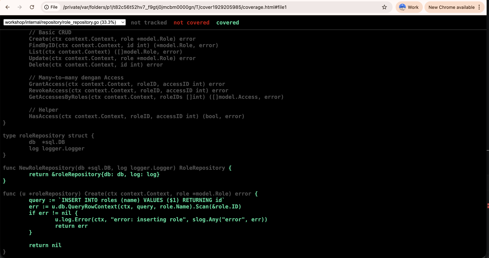

# Bab 20 : Unit Testing

Unit testing adalah praktik menulis kode untuk menguji kode lainnya. Tujuannya adalah memastikan setiap unit (fungsi, method, atau struct) berperilaku sesuai yang diharapkan. Dalam konteks ini, yang menjadi fokus adalah **coverage** — seberapa banyak cabang logika (branch) dan aturan bisnis yang teruji.

> **📂 Kode Lengkap Bab Ini:**  
> Seluruh kode yang dibahas di bab ini tersedia di GitHub:
>
> 🔗 [github.com/jacky-htg/workshop/tree/main/20-unit-testing](https://github.com/jacky-htg/workshop/tree/main/20-unit-testing)

## 20.1 Mengapa Unit Testing Penting?

| Manfaat | Penjelasan |
|---------|------------|
| Mendeteksi bug lebih awal | Menemukan error sebelum kode masuk ke production |
| Memudahkan refactoring | Jika kode diubah, test akan memastikan tidak ada yang rusak |
| Dokumentasi hidup | Test menunjukkan bagaimana seharusnya fungsi digunakan |
| Desain yang lebih baik | Kode yang sulit di-test biasanya menandakan desain yang buruk |

## 20.2 Prinsip Unit Testing di Go

**Aturan Emas:**
1. File test harus diakhiri dengan `_test.go`
2. Nama fungsi test dimulai dengan `Test`
3. Gunakan `testing.T` sebagai parameter
4. Setiap test harus independen (tidak tergantung urutan eksekusi)

```go
func TestNamaFungsi_Skenario(t *testing.T) {
    // Arrange (setup)
    // Act (execute)
    // Assert (verify)
}
```

## 20.3 Tools yang Digunakan

| Tool | Kegunaan |
|------|----------|
| `testing` | Package standar Go untuk unit testing |
| `github.com/stretchr/testify` | Assertions yang lebih ekspresif |
| `github.com/DATA-DOG/go-sqlmock` | Mock database untuk repository test |
| `net/http/httptest` | Mock HTTP server untuk handler test |

## 20.4 Test Repository

Repository memiliki ketergantungan pada `*sql.DB` dan `logger.Logger`. Karena kita sudah menerapkan **dependency injection**, kita bisa dengan mudah mengganti dependency asli dengan `mock`.

### Mock Logger

Buat logger kosong (no-op) untuk testing (`mock/mockpkg/logger.go`):

```go
package mockpkg

import (
	"context"

	"github.com/jacky-htg/go-libs/logger"
)

type MockLogger struct{}

func NewMockLogger() *MockLogger {
	return &MockLogger{}
}

func (m *MockLogger) Debug(ctx context.Context, msg string, args ...any) {}
func (m *MockLogger) Info(ctx context.Context, msg string, args ...any)  {}
func (m *MockLogger) Warn(ctx context.Context, msg string, args ...any)  {}
func (m *MockLogger) Error(ctx context.Context, msg string, args ...any) {}
func (m *MockLogger) With(args ...any) logger.Logger {
	return &MockLogger{}
}
```

### Mock Database dengan sqlmock

`sqlmock` memungkinkan kita mensimulasikan query database tanpa perlu database sungguhan.

Pola Umum Mocking:
- `ExpectQuery()` → untuk `QueryRowContext()` atau `QueryContext()`
- `ExpectExec()` → untuk `ExecContext()`
- `ExpectPrepare()` → untuk `PrepareContext()`

### Test untuk `QueryRowContext` (Create Role)

Buat file `internal/repository/role_repository_test.go`.

```go
func TestRoleRepository_Create_Success(t *testing.T) {
	db, mock, err := sqlmock.New()
	require.NoError(t, err)
	defer db.Close()

	log := mockpkg.NewMockLogger()
	repo := repository.NewRoleRepository(db, log)

	query := `INSERT INTO roles (name) VALUES ($1) RETURNING id`
	mock.ExpectQuery(regexp.QuoteMeta(query)).
		WithArgs("admin").
		WillReturnRows(sqlmock.NewRows([]string{"id"}).AddRow(1))

	ctx := context.Background()
	role := &model.Role{Name: "admin"}
	err = repo.Create(ctx, role)

	assert.NoError(t, err)
	assert.Equal(t, 1, role.ID)
	assert.NoError(t, mock.ExpectationsWereMet())
}

func TestRoleRepository_Create_Error(t *testing.T) {
	db, mock, err := sqlmock.New()
	require.NoError(t, err)
	defer db.Close()

	log := mockpkg.NewMockLogger()
	repo := repository.NewRoleRepository(db, log)

	query := `INSERT INTO roles (name) VALUES ($1) RETURNING id`
	mock.ExpectQuery(regexp.QuoteMeta(query)).
		WithArgs("admin").
		WillReturnError(errors.New("duplicate key value violates unique constraint"))

	ctx := context.Background()
	role := &model.Role{Name: "admin"}
	err = repo.Create(ctx, role)

	assert.Error(t, err)
	assert.NoError(t, mock.ExpectationsWereMet())
}
```


### Test untuk `QueryContext` (List Roles)

```go
func TestRoleRepository_List_Success(t *testing.T) {
	db, mock, err := sqlmock.New()
	require.NoError(t, err)
	defer db.Close()

	log := mockpkg.NewMockLogger()
	repo := repository.NewRoleRepository(db, log)

	expectedRoles := []model.Role{
		{ID: 1, Name: "admin"},
		{ID: 2, Name: "manager"},
	}

	query := `SELECT id, name FROM roles ORDER BY name`
	mock.ExpectQuery(regexp.QuoteMeta(query)).
		WillReturnRows(sqlmock.NewRows([]string{"id", "name"}).
			AddRow(expectedRoles[0].ID, expectedRoles[0].Name).
			AddRow(expectedRoles[1].ID, expectedRoles[1].Name),
		)

	ctx := context.Background()
	roles, err := repo.List(ctx)

	assert.NoError(t, err)
	assert.Equal(t, len(expectedRoles), len(roles))
	assert.Equal(t, expectedRoles[0].Name, roles[0].Name)
	assert.NoError(t, mock.ExpectationsWereMet())
}
```

### Test untuk `ExecContext` (Update Role)

```go
func TestRoleRepository_Update_Success(t *testing.T) {
	db, mock, err := sqlmock.New()
	require.NoError(t, err)
	defer db.Close()

	log := mockpkg.NewMockLogger()
	repo := repository.NewRoleRepository(db, log)

	query := `UPDATE roles SET name = $1 WHERE id = $2`
	mock.ExpectExec(regexp.QuoteMeta(query)).
		WithArgs(sqlmock.AnyArg(), sqlmock.AnyArg()).
		WillReturnResult(sqlmock.NewResult(0, 1))

	ctx := context.Background()
	role := &model.Role{Name: "admin"}
	err = repo.Update(ctx, role)

	assert.NoError(t, err)
	assert.NoError(t, mock.ExpectationsWereMet())
}
```

### Menjalankan Test Repository

Untuk mengetes bisa digunakan perintah 

```bash
# Jalankan satu test
go test ./internal/repository -run "TestRoleRepository_Create_Success"

# Jalankan semua test role repository
go test ./internal/repository -run "TestRoleRepository" -v

# Lihat coverage
go test -cover ./internal/repository

# Generate coverage report (HTML)
go test -coverprofile cover.out ./internal/repository
go tool cover -html cover.out
```




## 20.5 Test Service

Service bergantung pada `repository.RoleRepository` (interface). Kita buat **mock repository** untuk mengontrol perilaku yang diinginkan.

### Mock Repository untuk Service

buat file `mock/mockrepo/role.go`

```go
package mockrepo

import (
	"context"
	"workshop/internal/model"
)

type MockRoleRepo struct {
	CreateFunc   func(ctx context.Context, role *model.Role) error
	FindByIDFunc func(ctx context.Context, id int) (*model.Role, error)
	ListFunc     func(ctx context.Context) ([]model.Role, error)
	UpdateFunc   func(ctx context.Context, role *model.Role) error
	DeleteFunc   func(ctx context.Context, id int) error

	// Many-to-many dengan Access
	GrantAccessFunc        func(ctx context.Context, roleID, accessID int) error
	RevokeAccessFunc       func(ctx context.Context, roleID, accessID int) error
	GetAccessesByRolesFunc func(ctx context.Context, roleIDs []int) ([]model.Access, error)

	// Helper
	HasAccessFunc func(ctx context.Context, roleID, accessID int) (bool, error)
}

func (m *MockRoleRepo) Create(ctx context.Context, role *model.Role) error {
	if m.CreateFunc != nil {
		return m.CreateFunc(ctx, role)
	}
	return nil
}

func (m *MockRoleRepo) FindByID(ctx context.Context, id int) (*model.Role, error) {
	if m.FindByIDFunc != nil {
		return m.FindByIDFunc(ctx, id)
	}
	return nil, nil
}

func (m *MockRoleRepo) List(ctx context.Context) ([]model.Role, error) {
	if m.ListFunc != nil {
		return m.ListFunc(ctx)
	}
	return nil, nil
}

func (m *MockRoleRepo) Update(ctx context.Context, role *model.Role) error {
	if m.UpdateFunc != nil {
		return m.UpdateFunc(ctx, role)
	}
	return nil
}

func (m *MockRoleRepo) Delete(ctx context.Context, id int) error {
	if m.DeleteFunc != nil {
		return m.DeleteFunc(ctx, id)
	}
	return nil
}

func (m *MockRoleRepo) GrantAccess(ctx context.Context, roleID, accessID int) error {
	if m.GrantAccessFunc != nil {
		return m.GrantAccessFunc(ctx, roleID, accessID)
	}
	return nil
}

func (m *MockRoleRepo) RevokeAccess(ctx context.Context, roleID, accessID int) error {
	if m.RevokeAccessFunc != nil {
		return m.RevokeAccessFunc(ctx, roleID, accessID)
	}
	return nil
}

func (m *MockRoleRepo) GetAccessesByRoles(ctx context.Context, roleIDs []int) ([]model.Access, error) {
	if m.GetAccessesByRolesFunc != nil {
		return m.GetAccessesByRolesFunc(ctx, roleIDs)
	}
	return nil, nil
}

func (m *MockRoleRepo) HasAccess(ctx context.Context, roleID, accessID int) (bool, error) {
	if m.HasAccessFunc != nil {
		return m.HasAccessFunc(ctx, roleID, accessID)
	}
	return false, nil
}
```

### Test Service Update

Kita akan membuat unit test untuk fungsi `Update()` yang komplektitas-nya sedang. Buat file `internal/service/roles_test.go`

```go
package service_test

import (
	"context"
	"fmt"
	"testing"
	"workshop/internal/model"
	"workshop/internal/service"
	"workshop/mock/mockpkg"
	"workshop/mock/mockrepo"
	"workshop/pkg/errors"

	"github.com/stretchr/testify/assert"
)

func TestRoles_Update_Success(t *testing.T) {
	var expectedError *errors.BusinessError
	log := mockpkg.NewMockLogger()
	repo := &mockrepo.MockRoleRepo{
		FindByIDFunc: func(ctx context.Context, id int) (*model.Role, error) {
			return &model.Role{ID: id, Name: "admin"}, nil
		},
		UpdateFunc: func(ctx context.Context, role *model.Role) error {
			return nil
		},
	}

	svc := service.NewRoles(log, repo)

	role := &model.Role{ID: 1, Name: "Super Admin"}
	err := svc.Update(context.Background(), role)

	assert.Equal(t, expectedError, err)
}

func TestRoles_Update_Error_FindByID(t *testing.T) {
	setupErr := fmt.Errorf("error db")
	expectedError := errors.InternalServerErrorWrap(setupErr, "error finding role")

	log := mockpkg.NewMockLogger()
	repo := &mockrepo.MockRoleRepo{
		FindByIDFunc: func(ctx context.Context, id int) (*model.Role, error) {
			return nil, setupErr
		},
	}

	svc := service.NewRoles(log, repo)

	role := &model.Role{ID: 1, Name: "Super Admin"}
	err := svc.Update(context.Background(), role)

	assert.Equal(t, expectedError, err)
}

func TestRoles_Update_Error_NotFound(t *testing.T) {
	expectedError := errors.NotFound("role not found")

	log := mockpkg.NewMockLogger()
	repo := &mockrepo.MockRoleRepo{
		FindByIDFunc: func(ctx context.Context, id int) (*model.Role, error) {
			return nil, nil
		},
	}

	svc := service.NewRoles(log, repo)

	role := &model.Role{ID: 1, Name: "Super Admin"}
	err := svc.Update(context.Background(), role)

	assert.Equal(t, expectedError, err)
}

func TestRoles_Update_Error_Update(t *testing.T) {
	setupErr := fmt.Errorf("error db")
	expectedError := errors.InternalServerErrorWrap(setupErr, "error updating role")

	log := mockpkg.NewMockLogger()
	repo := &mockrepo.MockRoleRepo{
		FindByIDFunc: func(ctx context.Context, id int) (*model.Role, error) {
			return &model.Role{ID: id, Name: "admin"}, nil
		},
		UpdateFunc: func(ctx context.Context, role *model.Role) error {
			return setupErr
		},
	}

	svc := service.NewRoles(log, repo)

	role := &model.Role{ID: 1, Name: "Super Admin"}
	err := svc.Update(context.Background(), role)

	assert.Equal(t, expectedError, err)
}
```

## 20.6 Test Handler

Handler bergantung pada `service.Roles` (interface). Kita buat mock service dan gunakan `httptest` untuk mensimulasikan HTTP request.

### Mock Service untuk Handler

```go
package mocksvc

import (
	"context"
	"workshop/internal/model"
	"workshop/pkg/errors"
)

type MockRoles struct {
	ListFunc     func(ctx context.Context) ([]model.Role, *errors.BusinessError)
	FindByIDFunc func(ctx context.Context, id int) (*model.Role, *errors.BusinessError)
	CreateFunc   func(ctx context.Context, role *model.Role) *errors.BusinessError
	UpdateFunc   func(ctx context.Context, role *model.Role) *errors.BusinessError
	DeleteFunc   func(ctx context.Context, id int) *errors.BusinessError
	GrantFunc    func(ctx context.Context, roleID, accessID int) *errors.BusinessError
	RevokeFunc   func(ctx context.Context, roleID, accessID int) *errors.BusinessError
}

func (m *MockRoles) List(ctx context.Context) ([]model.Role, *errors.BusinessError) {
	if m.ListFunc != nil {
		return m.ListFunc(ctx)
	}
	return nil, nil
}

func (m *MockRoles) FindByID(ctx context.Context, id int) (*model.Role, *errors.BusinessError) {
	if m.FindByIDFunc != nil {
		return m.FindByIDFunc(ctx, id)
	}
	return nil, nil
}

func (m *MockRoles) Create(ctx context.Context, role *model.Role) *errors.BusinessError {
	if m.CreateFunc != nil {
		return m.CreateFunc(ctx, role)
	}
	return nil
}

func (m *MockRoles) Update(ctx context.Context, role *model.Role) *errors.BusinessError {
	if m.UpdateFunc != nil {
		return m.UpdateFunc(ctx, role)
	}
	return nil
}

func (m *MockRoles) Delete(ctx context.Context, id int) *errors.BusinessError {
	if m.DeleteFunc != nil {
		return m.DeleteFunc(ctx, id)
	}
	return nil
}

func (m *MockRoles) Grant(ctx context.Context, roleID, accessID int) *errors.BusinessError {
	if m.GrantFunc != nil {
		return m.GrantFunc(ctx, roleID, accessID)
	}
	return nil
}

func (m *MockRoles) Revoke(ctx context.Context, roleID, accessID int) *errors.BusinessError {
	if m.RevokeFunc != nil {
		return m.RevokeFunc(ctx, roleID, accessID)
	}
	return nil
}
```

### Test Handler Update

Buat file `internal/hanlder/role_handler_test.go`

```go
package handler_test

import (
	"bytes"
	"context"
	"encoding/json"
	"net/http"
	"net/http/httptest"
	"testing"
	"workshop/internal/dto"
	"workshop/internal/handler"
	"workshop/internal/model"
	"workshop/mock/mockpkg"
	"workshop/mock/mocksvc"
	"workshop/pkg/errors"
	"workshop/pkg/response"

	"github.com/go-playground/validator/v10"
	"github.com/stretchr/testify/assert"
	"github.com/stretchr/testify/require"
)

func TestRoleHandler_Update_Success(t *testing.T) {
	// Setup
	log := mockpkg.NewMockLogger()
	validate := validator.New()

	// Mock service
	mockService := &mocksvc.MockRoles{
		UpdateFunc: func(ctx context.Context, role *model.Role) *errors.BusinessError {
			// Verify the role data
			assert.Equal(t, 1, role.ID)
			assert.Equal(t, "Super Admin", role.Name)
			return nil
		},
	}

	handler := handler.NewRoleHandler(log, validate, mockService)

	// Create request body
	reqBody := dto.RoleRequest{
		Name: "Super Admin",
	}
	jsonBody, _ := json.Marshal(reqBody)

	// Create request
	req := httptest.NewRequest(http.MethodPut, "/roles/1", bytes.NewBuffer(jsonBody))
	req.SetPathValue("id", "1")
	req = req.WithContext(context.Background())

	// Create response recorder
	w := httptest.NewRecorder()

	// Execute
	handler.Update(w, req)

	// Assert
	assert.Equal(t, http.StatusOK, w.Code)

	// Parse response
	var resp response.StandardResponse
	err := json.Unmarshal(w.Body.Bytes(), &resp)
	require.NoError(t, err)
	assert.Equal(t, "B1", resp.Status)
	assert.Equal(t, "Success", resp.Message)

	// Verify response data
	data, ok := resp.Data.(map[string]interface{})
	assert.True(t, ok)
	assert.Equal(t, float64(1), data["id"])
	assert.Equal(t, "Super Admin", data["name"])
}

func TestRoleHandler_Update_InvalidID(t *testing.T) {
	// Setup
	log := mockpkg.NewMockLogger()
	validate := validator.New()
	mockService := &mocksvc.MockRoles{}
	handler := handler.NewRoleHandler(log, validate, mockService)

	// Create request with invalid ID
	reqBody := dto.RoleRequest{Name: "Admin"}
	jsonBody, _ := json.Marshal(reqBody)

	req := httptest.NewRequest(http.MethodPut, "/roles/invalid", bytes.NewBuffer(jsonBody))
	req.SetPathValue("id", "invalid") // Invalid ID (not a number)
	req = req.WithContext(context.Background())

	w := httptest.NewRecorder()

	// Execute
	handler.Update(w, req)

	// Assert
	assert.Equal(t, http.StatusBadRequest, w.Code)

	var resp response.StandardResponse
	err := json.Unmarshal(w.Body.Bytes(), &resp)
	require.NoError(t, err)
	assert.Equal(t, "E001", resp.Status)
	assert.Contains(t, resp.Message, "Invalid id")
}

func TestRoleHandler_Update_MissingID(t *testing.T) {
	// Setup
	log := mockpkg.NewMockLogger()
	validate := validator.New()
	mockService := &mocksvc.MockRoles{}
	handler := handler.NewRoleHandler(log, validate, mockService)

	// Create request without ID
	reqBody := dto.RoleRequest{Name: "Admin"}
	jsonBody, _ := json.Marshal(reqBody)

	req := httptest.NewRequest(http.MethodPut, "/roles/", bytes.NewBuffer(jsonBody))
	// No path value set for "id"
	req = req.WithContext(context.Background())

	w := httptest.NewRecorder()

	// Execute
	handler.Update(w, req)

	// Assert
	assert.Equal(t, http.StatusBadRequest, w.Code)

	var resp response.StandardResponse
	err := json.Unmarshal(w.Body.Bytes(), &resp)
	require.NoError(t, err)
	assert.Equal(t, "E001", resp.Status)
	assert.Contains(t, resp.Message, "Missing id parameter")
}

func TestRoleHandler_Update_InvalidJSON(t *testing.T) {
	// Setup
	log := mockpkg.NewMockLogger()
	validate := validator.New()
	mockService := &mocksvc.MockRoles{}
	handler := handler.NewRoleHandler(log, validate, mockService)

	// Create request with invalid JSON
	invalidJSON := []byte(`{"name": "Admin"`) // Missing closing brace

	req := httptest.NewRequest(http.MethodPut, "/roles/1", bytes.NewBuffer(invalidJSON))
	req.SetPathValue("id", "1")
	req = req.WithContext(context.Background())

	w := httptest.NewRecorder()

	// Execute
	handler.Update(w, req)

	// Assert
	assert.Equal(t, http.StatusBadRequest, w.Code)

	var resp response.StandardResponse
	err := json.Unmarshal(w.Body.Bytes(), &resp)
	require.NoError(t, err)
	assert.Equal(t, "E001", resp.Status)
}

func TestRoleHandler_Update_ValidationError(t *testing.T) {
	// Setup
	log := mockpkg.NewMockLogger()
	validate := validator.New()
	mockService := &mocksvc.MockRoles{}
	handler := handler.NewRoleHandler(log, validate, mockService)

	// Create request with empty name (assuming validation requires name)
	reqBody := dto.RoleRequest{
		Name: "", // Empty name
	}
	jsonBody, _ := json.Marshal(reqBody)

	req := httptest.NewRequest(http.MethodPut, "/roles/1", bytes.NewBuffer(jsonBody))
	req.SetPathValue("id", "1")
	req = req.WithContext(context.Background())

	w := httptest.NewRecorder()

	// Execute
	handler.Update(w, req)

	// Assert - should return validation error if Name field has validation tag
	assert.Equal(t, http.StatusBadRequest, w.Code)

	var resp response.StandardResponse
	err := json.Unmarshal(w.Body.Bytes(), &resp)
	require.NoError(t, err)
	assert.Equal(t, "E001", resp.Status)
}

func TestRoleHandler_Update_ServiceNotFoundError(t *testing.T) {
	// Setup
	log := mockpkg.NewMockLogger()
	validate := validator.New()

	// Mock service that returns not found error
	mockService := &mocksvc.MockRoles{
		UpdateFunc: func(ctx context.Context, role *model.Role) *errors.BusinessError {
			return errors.NotFound("role not found")
		},
	}

	handler := handler.NewRoleHandler(log, validate, mockService)

	// Create request
	reqBody := dto.RoleRequest{Name: "Updated Name"}
	jsonBody, _ := json.Marshal(reqBody)

	req := httptest.NewRequest(http.MethodPut, "/roles/999", bytes.NewBuffer(jsonBody))
	req.SetPathValue("id", "999")
	req = req.WithContext(context.Background())

	w := httptest.NewRecorder()

	// Execute
	handler.Update(w, req)

	// Assert
	assert.Equal(t, http.StatusNotFound, w.Code)

	var resp response.StandardResponse
	err := json.Unmarshal(w.Body.Bytes(), &resp)
	require.NoError(t, err)
	assert.Equal(t, "E002", resp.Status)
	assert.Contains(t, resp.Message, "role not found")
}

func TestRoleHandler_Update_ServiceInternalServerError(t *testing.T) {
	// Setup
	log := mockpkg.NewMockLogger()
	validate := validator.New()

	// Mock service that returns internal server error
	mockService := &mocksvc.MockRoles{
		UpdateFunc: func(ctx context.Context, role *model.Role) *errors.BusinessError {
			return errors.InternalServerError("database connection failed")
		},
	}

	handler := handler.NewRoleHandler(log, validate, mockService)

	// Create request
	reqBody := dto.RoleRequest{Name: "Updated Name"}
	jsonBody, _ := json.Marshal(reqBody)

	req := httptest.NewRequest(http.MethodPut, "/roles/1", bytes.NewBuffer(jsonBody))
	req.SetPathValue("id", "1")
	req = req.WithContext(context.Background())

	w := httptest.NewRecorder()

	// Execute
	handler.Update(w, req)

	// Assert
	assert.Equal(t, http.StatusInternalServerError, w.Code)

	var resp response.StandardResponse
	err := json.Unmarshal(w.Body.Bytes(), &resp)
	require.NoError(t, err)
	assert.Equal(t, "E000", resp.Status)
	assert.Contains(t, resp.Message, "database connection failed")
}
```

## 20.7 Menjalankan Semua Test

```bash
# Jalankan semua test di semua package
go test ./...

# Dengan verbose (detail)
go test -v ./...

# Dengan coverage
go test -cover ./...

# Coverage ke file dan lihat di browser
go test -coverprofile=coverage.out ./...
go tool cover -html=coverage.out
```

## 20.8 Best Practices Unit Testing

| Praktik | Penjelasan |
|---------|------------|
| Satu skenario per test | Satu fungsi test hanya menguji satu skenario (success atau satu jenis error) |
| Nama test deskriptif | TestNamaFungsi_Skenario_Hasil → TestRoleRepository_Create_DuplicateKey_Error |
| Gunakan table-driven test | Untuk skenario yang mirip dengan input berbeda |
| Mock eksternal dependency | Database, API, file system harus di-mock |
| Test edge cases | Nilai kosong, limit, negative, dll |

### Contoh Table-Driven Test

```go
func TestValidateEmail(t *testing.T) {
    tests := []struct {
        name    string
        email   string
        wantErr bool
    }{
        {"valid email", "user@example.com", false},
        {"empty email", "", true},
        {"no @ symbol", "userexample.com", true},
        {"no domain", "user@", true},
    }

    for _, tt := range tests {
        t.Run(tt.name, func(t *testing.T) {
            err := validateEmail(tt.email)
            if tt.wantErr {
                assert.Error(t, err)
            } else {
                assert.NoError(t, err)
            }
        })
    }
}
```

## Ringkasan Bab 20

Di bab ini kita telah belajar:

| Komponen | Pendekatan Test | Tools |
|----------|-----------------|-------|
| Repository | Mock database | sqlmock |
| Service | Mock repository | Custom mock struct |
| Handler | Mock service + HTTP mock | httptest |

Manfaat yang kita peroleh:
- ✅ Setiap fungsi memiliki test yang memverifikasi perilaku
- ✅ Dependency eksternal (database) tidak perlu untuk testing
- ✅ Coverage bisa diukur dan ditingkatkan
- ✅ Refactoring kode lebih aman

Yang akan datang:
- Unit testing menguji komponen secara terisolasi
- Bab selanjutnya: API Testing – menguji endpoint secara end-to-end dengan database dan server sungguhan