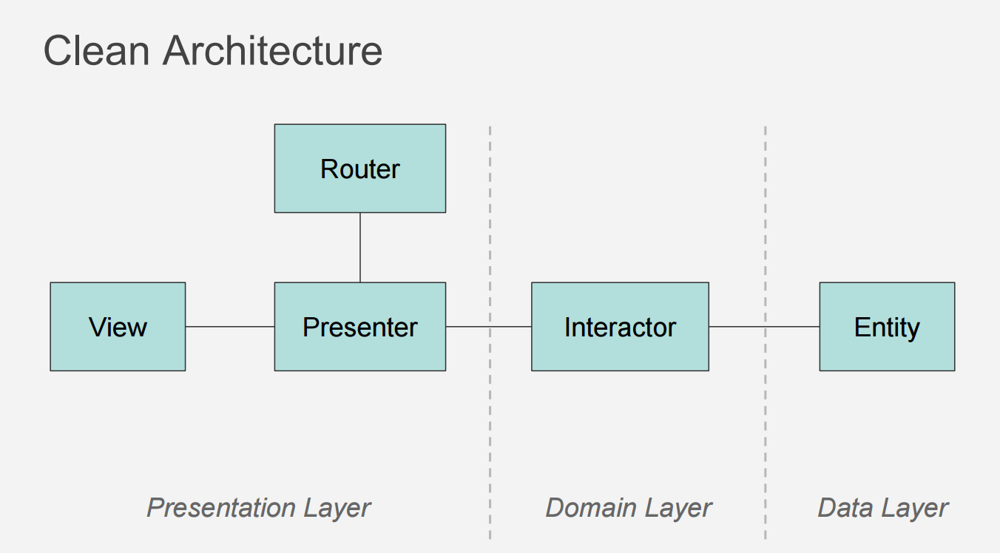

# Clean architecture



- Terdiri dari 3 layer: presentation layer, domain layer, dan data layer.
- Presentation layer meliputi : routing, payload request dan payload response.
- Domain layer meliputi : use case yang berisi interaction dan logic
- Data layer meliputi : entity / model 
- Untuk mengadopsi clean architecture, dibuat struktur direktori aplikasi sebagai berikut :

```
> cmd
> controllers
> libraries
> models
> payloads
    > request
    > response
> schema
> usecases
```

- Implementasi tidak harus kaku. Tidak semua endpoint harus ada use case. Pattern use case digunakan jika mengandung banyak logic, atau melibatkan banyak model. Jika endpoint sederhana dengan hanya 1 model, tidak perlu membuat use case.
- Dalam contoh list user, karena masih sederhana, kita tidak akan menggunakan use case.
- Kita akan memecah kode di file main.go menjadi 5 file yaitu :

```
main.go -> berisi kode untuk handling start up dan shutdown 
cmd/main.go -> berisi kode untuk handling console command, yaitu migrate dan seed
libraries/database/database.go -> berisi kode untuk membuat koneksi database
controllers/users.go -> berisi struct Users dan method List handler 
models/user.go -> berisi struct User dan method List untuk mendapatkan data list user dari database
payloads/response/user_response.go -> Format json response dari list user
``` 

- Berikut isi dari file libraries/database/database.go

```
package database

import "database/sql"

//Open : open database
func Open() (*sql.DB, error) {
	return sql.Open("mysql", "root:pass@tcp(localhost:3306)/essentials?parseTime=true")
}

```

- Berikut isi dari file cmd/main.go

```
package main

import (
	"essentials/libraries/database"
	"essentials/schema"
	"flag"
	"log"
	"os"

	_ "github.com/go-sql-driver/mysql"
)

func main() {
	// Start Database
	db, err := database.Open()
	if err != nil {
		log.Fatalf("error: connecting to db: %s", err)
	}
	defer db.Close()

	// Handle cli command
	flag.Parse()

	switch flag.Arg(0) {
	case "migrate":
		if err := schema.Migrate(db); err != nil {
			log.Println("error applying migrations", err)
			os.Exit(1)
		}
		log.Println("Migrations complete")
		return

	case "seed":
		if err := schema.Seed(db); err != nil {
			log.Println("error seeding database", err)
			os.Exit(1)
		}
		log.Println("Seed data complete")
		return
	}
}

```

- Berikut isi dari file models/user.go

```
package models

import (
	"database/sql"
)

// User : struct of User
type User struct {
	ID       uint
	Username string
	Password string
	Email    string
	IsActive bool
}

const qUser = `SELECT id, username, password, email, is_active FROM users`

// List of users
func (u *User) List(db *sql.DB) ([]User, error) {
	var list []User

	rows, err := db.Query(qUser)
	if err != nil {
		return list, err
	}

	defer rows.Close()

	for rows.Next() {
		var user User
		if err := rows.Scan(&user.ID, &user.Username, &user.Password, &user.Email, &user.IsActive); err != nil {
			return list, err
		}
		list = append(list, user)
	}

	return list, rows.Err()
}

```

- Berikut adalah isi dari file payloads/response/user_response.go

```
package response

import "essentials/models"

// UserResponse struct for response of user
type UserResponse struct {
	ID       uint   `json:"id"`
	Username string `json:"username"`
	Email    string `json:"email"`
	IsActive bool   `json:"is_active"`
}

// Transform from models.User to UserResponse
func (u *UserResponse) Transform(user models.User) {
	u.ID = user.ID
	u.Username = user.Username
	u.Email = user.Email
	u.IsActive = user.IsActive
}

```

- Berikut isi file controllers/users.go

```
package controllers

import (
	"database/sql"
	"encoding/json"
	"essentials/models"
	"essentials/payloads/response"
	"log"
	"net/http"
)

// Users : struct for set Users Dependency Injection
type Users struct {
	Db *sql.DB
}

// List : http handler for returning list of users
func (u *Users) List(w http.ResponseWriter, r *http.Request) {
	user := new(models.User)
	list, err := user.List(u.Db)
	if err != nil {
		log.Println("error get list user", err)
		w.WriteHeader(http.StatusInternalServerError)
		return
	}

	var responseList []response.UserResponse
	for _, l := range list {
		var res response.UserResponse
		res.Transform(l)
		responseList = append(responseList, res)
	}

	data, err := json.Marshal(responseList)
	if err != nil {
		log.Println("error marshalling result", err)
		w.WriteHeader(http.StatusInternalServerError)
		return
	}

	w.Header().Set("Content-Type", "application/json; charset=utf-8")
	w.WriteHeader(http.StatusOK)
	if _, err := w.Write(data); err != nil {
		log.Println("error writing result", err)
	}
}

```

- Dan isi dari file main.go adalah :

```
package main

import (
	"context"
	"essentials/controllers"
	"essentials/libraries/database"
	"log"
	"net/http"
	"os"
	"os/signal"
	"syscall"
	"time"

	_ "github.com/go-sql-driver/mysql"
)

func main() {
	// =========================================================================
	// App Starting

	log.Printf("main : Started")
	defer log.Println("main : Completed")

	// =========================================================================

	// Start Database

	db, err := database.Open()
	if err != nil {
		log.Fatalf("error: connecting to db: %s", err)
	}
	defer db.Close()

	// Create variable service with pattern dependency injection.
	// Inject koneksion db to type of Users
	service := controllers.Users{Db: db}

	// parameter server
	server := http.Server{
		Addr:         "0.0.0.0:9000",
		Handler:      http.HandlerFunc(service.List),
		ReadTimeout:  5 * time.Second,
		WriteTimeout: 5 * time.Second,
	}

	serverErrors := make(chan error, 1)
	// mulai listening server
	go func() {
		log.Println("server listening on", server.Addr)
		serverErrors <- server.ListenAndServe()
	}()

	// Membuat channel untuk mendengarkan sinyal interupsi/terminate dari OS.
	// Menggunakan channel buffered karena paket signal membutuhkannya.
	shutdown := make(chan os.Signal, 1)
	signal.Notify(shutdown, os.Interrupt, syscall.SIGTERM)

	// Mengontrol penerimaan data dari channel,
	// jika ada error saat listenAndServe server maupun ada sinyal shutdown yang diterima
	select {
	case err := <-serverErrors:
		log.Fatalf("error: listening and serving: %s", err)

	case <-shutdown:
		log.Println("caught signal, shutting down")

		// Jika ada shutdown, meminta tambahan waktu 5 detik untuk menyelesaikan proses yang sedang berjalan.
		const timeout = 5 * time.Second
		ctx, cancel := context.WithTimeout(context.Background(), timeout)
		defer cancel()

		if err := server.Shutdown(ctx); err != nil {
			log.Printf("error: gracefully shutting down server: %s", err)
			if err := server.Close(); err != nil {
				log.Printf("error: closing server: %s", err)
			}
		}
	}

	log.Println("done")
}
```

